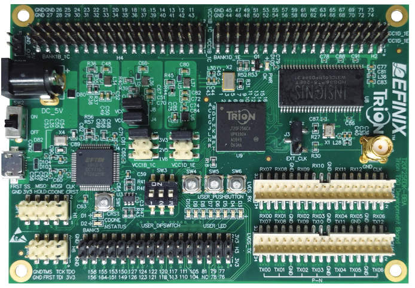
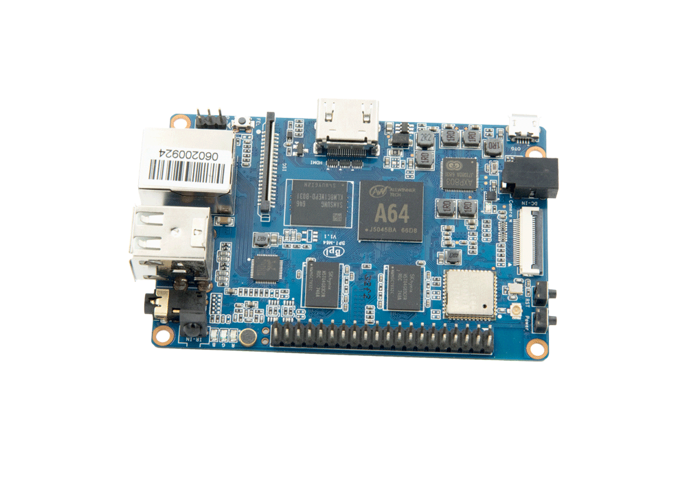

# BPI_M64_Trion_SPI
Banana Pi M64 communicate with Efinix Trion FPAG double way based on SPI interface


## 采用Efinix Trion系列FPGA快速设计MIPI接口的摄像头应用

```
        .-"""-.
       / .===. \
       \/ 6 6 \/
       ( \___/ )
  _ooo__\_____/______
 /                   \
| BPI_M64_Trion_SPI   |
 \_______________ooo_/
        |  |  |
        |_ | _|
        |  |  |
        |__|__|
        /-'Y'-\
       (__/ \__)


 ____   ___ ____   ___         ___ ____   ___   __   
|___ \ / _ \___ \ / _ \       / _ \___ \ / _ \ / /_  
  __) | | | |__) | | | |_____| | | |__) | | | | '_ \
 / __/| |_| / __/| |_| |_____| |_| / __/| |_| | (_) |
|_____|\___/_____|\___/       \___/_____|\___/ \___/

```
## Description

> 项目目的：

通过这个项目， 来快速了解如何使用Efinix FPGA和BananPi 之间如何进行双向通信的最简单的案例
在Trion FPGA的设计工程中，　我们也加入了在线逻辑分析器，可以实时捕捉BananaPi上发来的SPI接口上的数据。　


This repo focus on introduction Efinix Trion Series T20 FPGA communicate with BananaPi based on SPI interface

- README.md  the project readme file
- Efinix 的官网是 www.efinixinc.com


Efinix FPGA 的第一个低成本FPGA家族是 Trion :
- you can register to access the documentation
- we will provide the EVB and software for your evaluation.
- ...


## Trion FPGA Family

```
  T4,T8 configuation multi_image pin is not inside of chip
  T20~T120, the configuation multi_image pin is inside of chip

- FPGA lower than 30mw
  - T4,T8      : 4K , 8K  pure soft logic fabric product
  - Package    : 5x5mm FBGA81, 55 GPIOs
  - EVB        :
    - T8EVB with build in programmer, you only need PC with USB
    - T20MIPIEVB with build in MIPI and High density I/O socket to connect MIPI CSI
-
```

## Software

On Ubuntu 16LTS : Efinix provide the Free FPGA develop suit, you need register it and buy one piece of EVB

```sh

这个案例基于Efinity 2019.3
```
Other features :

- Efinity 2018.4, we use the Version 2018.4 test the project, you can use Efinity 2019.3 or other advanced version

## Hardware of Trion FPGA

- The Project is based on Efinix T20EVB, its main features is as follows:

-



## Hardware of  Banana Pi M64

－　It is cost effective ARM64bit SBC, it have better performance than Raspberry Pi 3

```
Key Features:
Allwinner A64 1.2 Ghz Quad-Core ARM Cortex A53
Dual core Mali 400 MP2
8GB eMMC
2GB DDR
WiFi 802.11 b/g/n/ac BT4.0
10/100/1000Mbps Ethernet
```




## 注册通过后，可以下载芯片手册以及软件资料。

[Efinix Account Register Link](http://www.efinixinc.com/shop/index)

## Project name


- STEP1: install Efinity 2018.4 or other advanced version in Win or Ubuntu
- STEP2: get ready of the T20EVB,  

    - if you have same EVB with Efinix engieers, with the other words, it is easy to find the issue with same two boards when you need tech support.

- STEP3: download the total repository directory into Efinity project directory, for examples, C:\Efinity\2019.3\project\demo spi

- STEP4: open the Efinity project ILA tools

- STEP5: download the FPGA design hex into FPGA, it is all set

- STEP6: the design enclose the ILA module, you can debug it on line
- STEP7: run the BananaPi programe according to document

## Documentation

系统中的文档参考了，注册Efinix用户后， 可以下载更加详细的应用指南


- BPI_c_code  
- BPI-M64_small.jpg  
- BPI_T20_SPI_small.jpg  
- BPI_Trion_SPI.pdf  
- FPGA_prj  


## Update

-Feb-6-2020, test all code with Efinity Ver 2019.3.272

 Tester by Ben Chen in Windows,
 Tester by Wisdom zhang in Ubuntu16


## Acknowledge

Project contributor is major from Ben Chen
Project get the great support from Banana-Pi.org

Project upload by Wisdom Zhang

Anything question: email: 909614802 at qq dot com
```
 _____  __ _       _      
| ____|/ _(_)_ __ (_)_  __
|  _| | |_| | '_ \| \ \/ /
| |___|  _| | | | | |>  <
|_____|_| |_|_| |_|_/_/\_\

____                                      ____  _
| __ )  __ _ _ __   __ _ _ __   __ _      |  _ \(_)
|  _ \ / _` | '_ \ / _` | '_ \ / _` |_____| |_) | |
| |_) | (_| | | | | (_| | | | | (_| |_____|  __/| |
|____/ \__,_|_| |_|\__,_|_| |_|\__,_|     |_|   |_|


```
